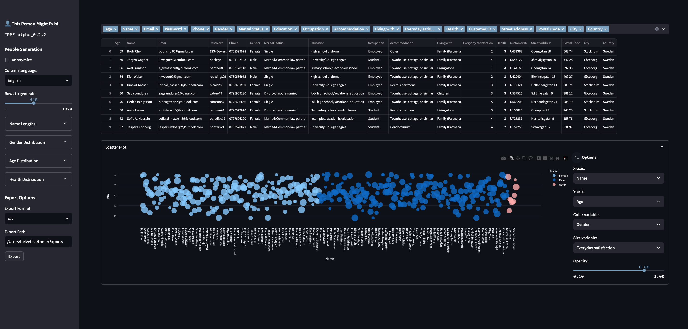

# This Person Might Exist - Procedurally generated people.


Generate rows of persons with attributes such as phone number, name, email, health and more with this Streamlit web app.

[Check the notebook](demo.ipynb) for a demo.

**Export support**: CSV, Excel, SQL

---

### GDPR Notice

>Some data generated with this tool might result in **real** personal data. Make sure to anonymize colums with sensitive information if you use this tool for anything public.

## Install TPME with Docker

### Prerequisites

- Docker installed on your machine. You can download and install Docker from the [official Docker website](https://www.docker.com/products/docker-desktop).

### Steps

1. **Clone this repository**

    ```sh
    git clone https://github.com/wlinds/tpme.git
    ```

2. **Build the Docker image**

    ```sh
    docker build -t tpme .
    ```

3. **Run the Docker container**

    ```sh
    docker run -d -p 8501:8501 tpme
    ```

4. **Access the application**

    Open your web browser and go to `http://localhost:8501`.

## Application Structure

```sh
tpme/
├── app.py # Main GUI
├── requirements.txt # Python dependencies
└── Dockerfile # Docker configuration file
```

## Contributing

Feel free to fork this repository and submit pull requests. For major changes, please open an issue first to discuss what you would like to change.